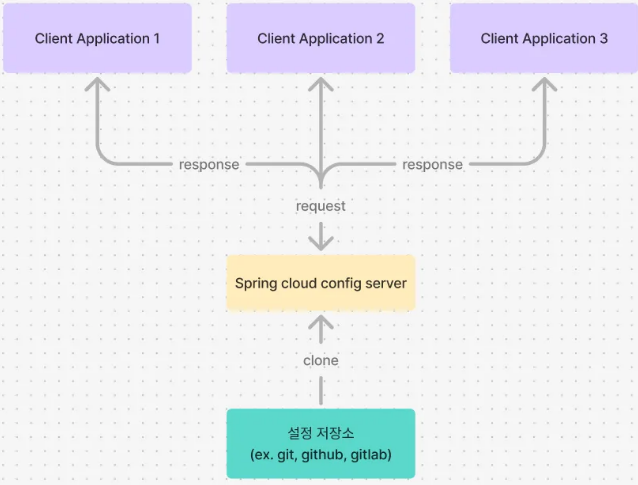
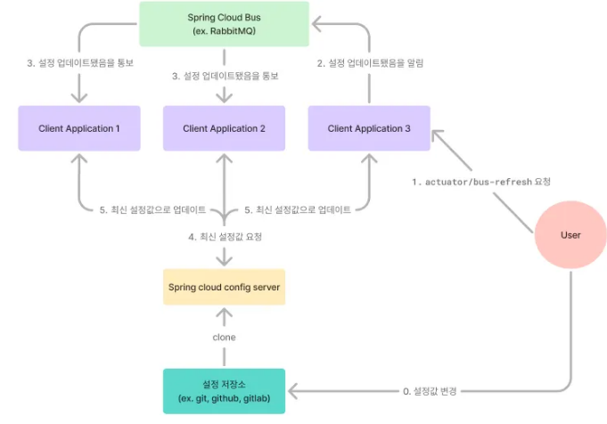

**Spring Cloud Config**는 마이크로서비스 아키텍처(MSA) 환경에서 여러 서비스의 **외부 설정**을 중앙에서 관리하는 데 사용되는 솔루션입니다. 

- 이를 통해 **애플리케이션 설정**(예: 데이터베이스 연결 정보, API 엔드포인트 등)을 **하드코딩**하는 대신, 중앙화된 저장소에서 관리하고,
- 서비스가 실행될 때 동적으로 해당 설정을 불러올 수 있습니다.

---

### **주요 특징**

1. **중앙화된 설정 관리**:
    - Spring Cloud Config는 여러 마이크로서비스에서 사용되는 설정을 **중앙화된 저장소**(Git, SVN 등)에 저장하고, 이를 여러 서비스에서 읽어올 수 있게 합니다.
    - 또한, 각 환경 (개발, 테스트, 프로덕션 등)에 대한 설정을 중앙에서 관리할 수 있습니다.
    - 이를 통해 애플리케이션 설정의 일관성을 유지하고, 설정 변경을 손쉽게 할 수 있습니다.
    - 특히, 여러 명이 개발하는 상황에서 **개발자마다 로컬 환경 설정이 달라도** 서버에서 관리되는 설정을 통해 일관성을 유지할 수 있습니다.
2. **버전 관리**:
    - 설정 파일을 **Git** 리포지토리 등 버전 관리 시스템에 저장함으로써, 설정의 버전 관리 및 히스토리를 관리할 수 있습니다. 이는 설정을 추적하고 롤백할 수 있는 장점이 있습니다.
3. **설정 변경 시 애플리케이션 재배포 없이 적용 가능**:
    - 애플리케이션이 실행 중일 때, 설정을 변경한 후 **동적으로 재시작 없이 설정을 반영**할 수 있습니다. Spring Cloud Config 서버는 클라이언트 서비스가 필요할 때 최신 설정을 제공할 수 있습니다.
4. **프로파일 지원**:
    - Spring Profiles을 지원하여 **개발, 테스트, 운영 환경** 등 각 환경에 맞는 설정을 분리하여 관리할 수 있습니다.
5. **애플리케이션 외부화**:
    - 설정을 애플리케이션 내부가 아닌 외부에 저장하여, 애플리케이션 코드와 설정을 분리할 수 있습니다. 이는 설정의 변경을 코드의 수정 없이도 가능하게 합니다.
    

---

### Spring Cloud Config의 단점

- **중앙화된 의존성**:
    - Spring Cloud Config 서버는 중앙화된 설정 저장소 역할을 하기 때문에, 만약 **Config 서버에 문제가 발생**하면 모든 마이크로서비스가 설정을 로드할 수 없게 됩니다. 이로 인해 **단일 실패 지점(Single Point of Failure, SPOF)**가 될 수 있습니다.
    - 이를 해결하려면 **Config 서버의 고가용성(HA) 설정**과 **백업**을 고려해야 합니다.
- **성능 문제**:
    - **Git**을 저장소로 사용할 경우, **저장소에서 설정을 읽어오는 시간이 발생**합니다. 이로 인해 서비스 시작 시 설정을 가져오는 데 시간이 걸릴 수 있고, 특히 설정이 자주 변경되면 성능이 저하될 수 있습니다.
    - 이를 해결하려면 **캐싱**이나 **설정 변경 간격**을 조정하는 방식으로 성능을 개선할 수 있습니다.
- **보안 문제**:
    - 민감한 정보를 Git과 같은 리포지토리에 저장하는 것은 보안에 취약할 수 있습니다. **민감한 정보는 별도의 보안 메커니즘(예: Vault, 환경 변수)으로 보호**해야 합니다.
    - Spring Cloud Config 자체에서는 민감한 데이터를 암호화할 수 있지만, 이를 잘못 구성할 경우 보안 문제가 발생할 수 있습니다.
        - 예를 들어, 암호화 키가 **노출**되거나 **부적절한 방식**으로 관리되면 암호화된 데이터를 쉽게 복호화할 수 있게 되어 민감한 정보가 **유출**될 수 있습니다.

---

## 작동 방식



### 업데이트된 설정은 클라이언트 어플리케이션에 어떻게 적용할까?

1️⃣ **직접 client application에 업데이트하라는 요청 보내는 방식**

깃에 저장되어있는 yaml 파일이 변경되었을 때, 관련 의존성 및 빈들도 업데이트해줘야 한다. 

하지만, client application 입장에선 설정이 변했다는 것을 알 방도가 없다. 그렇기에 client application에게 설정을 업데이트하라는 알림을 보내줘야 한다. 

그 방식이 바로 `/actuator/refresh` 엔드포인트로, client application 서버한테 해당 엔드포인트로 post 요청을 보내면 `@RefreshScope` 이 할당된 빈들에 대해서만 업데이트가 된다.

```bash
$ curl -X POST "http://localhost:8080/actuator/refresh"
```

2️⃣ **메세징 큐를 활용해 모든 클라이언트 어플리케이션들을 모두 한번에 업데이트하는 방식 (Spring Cloud Bus)**

하지만, MSA 환경에서는 어플리케이션이 여러 개일 확률이 높은데, 모든 서비스한테 일일이 post 요청 보내는 건 매우 귀찮은 일이다. 이를 해결할 수 있는 방법은 바로 메세징 큐를 사용하는 Spring Cloud Bus 방법이다.

설정이 업데이트되었을 때, 한 클라이언트의 `actuator/bus-refresh` 엔드포인트를 호출하면, 자동적으로 메세징 큐에 연결된 모든 클라이언트들에서 설정값이 갱신된다. 메세징 큐가 다른 클라이언트들에게 설정 업데이트하라는 알림을 대신 보내주는 역할을 하는 것이다. 



3️⃣ **Config Server 자동 업데이트 방식**

하지만 위 두 방식은 모두 클리아언트 어플리케이션들이 요청할 때마다 config server는 git에 접근하여 설정값을 읽어와야한다. 이는 어플리케이션 시작 시 로딩 시간이 길다는 단점이 존재한다. 더불어, 수동적으로 어플리케이션드에게 요청을 해야만 업데이트가 되는 방식이다.

그렇다면 자동적으로 spring cloud config server를 업데이트하면서도, 설정 값을 더욱 빨리 어플리케이션에게 전달하는 방법이 없을까?

우선 설정값들을 어플리케이션에게 빨리 전달하는 방법은 `clone-on-start: true` 하는 것이다. 이 설정은 config server가 처음 시작할 때만 저장소를 클론해서 로컬에 저장하고, 어플리케이션들이 요청 때마다 깃에 가지 않고 바로 반환해준다.

하지만 여기서 문제는, 만약 설정이 업데이트하면 config server는 옛날 버전의 설정값들을 저장하고 있어 어플리케이션들은 업데이트가 안된다.

그렇다면 여전히 또 수동적으로 업데이트해야하는 것인가?

이 문제는 github webhook를 이용해서 해결할 수 있다. 깃같은 저장소에서 설정들이 바뀌면, config server에게 저장소를 다시 클론하라는 요청을 자동적으로 보내게끔 설정하고, 그 요청을 받은 config server는 어플리케이션 또는 spring cloud bus에게 업데이트 알림을 보내는 방식이다. 더 자세히 말하자면 깃에 push가 되면 config server의 `/monitor` 엔드포인트로 요청을 보내는 webhook을 설정하는 것이다. 

<aside>
💡

**`/monitor` 엔드포인트**

`spring-cloud-config-monitor` 의존성은 spring cloud config server에게 `/monitor` 엔드포인트를 제공한다. 

</aside>

---

## MSA에서 사용하는 이유

이런 단점에도 불구하고 MSA에서 Spring Cloud Config을 사용하는 이유는

- 설정을 중앙에서 관리하여 **일관성**을 유지하고, 설정 변경을 쉽게 반영할 수 있기 때문입니다.
- **또한, 동적 갱신**과 **버전 관리**를 통해 관리 효율성을 높이고,
- 환경별 설정을 분리하여 적용할 수 있기 때문입니다.

---

## 구현

### 1. Spring Cloud Config 서버 생성

**1.1 Spring Boot 프로젝트 생성 및 의존성 추가**

- 필요한 의존성:
    - Spring Web
    - Spring Cloud Config Server
    - Spring Boot Actuator

**1.2** `@EnableConfigServer` 애너테이션 추가

- Spring Cloud Config 서버에서 설정 파일을 제공하려면, `@EnableConfigServer` 애너테이션을 추가해야 합니다.
    
    ```java
    import org.springframework.boot.SpringApplication;
    import org.springframework.boot.autoconfigure.SpringBootApplication;
    import org.springframework.cloud.config.server.EnableConfigServer;
    
    @SpringBootApplication
    @EnableConfigServer
    public class ConfigServerApplication {
        public static void main(String[] args) {
            SpringApplication.run(ConfigServerApplication.class, args);
        }
    }
    ```
    

**1.3** `application.yml` 설정

- Config 서버가 사용하는 `application.yml` 파일을 설정합니다.
- 이때, 이 파일에서는 설정 저장소(Git 또는 파일 시스템)의 경로를 지정해야 합니다.
    
    ```yaml
    # application.yml
    server:
      port: 8888
    
    spring:
      cloud:
        config:
          server:
            git:
              uri: https://github.com/your-username/your-repo  # Git 저장소 URL
              username: your-github-username
              password: ${GITHUB_TOKEN}
              clone-on-start: true 
    ```
    
    - 설정 저장소 (ex. github)는 보안상 private인 것이 좋고, config server가 해당 저장소에 접근하려면 토큰이 필요하다. 해당 토큰을 사용할 수 있게끔 환경변수화하는 것이 좋음
    - `clone-on-start`
        - 

**1.5 Config 서버 실행**

- Config 서버를 실행하면 클라이언트 애플리케이션이 이 서버에서 설정을 가져올 수 있습니다.
- 기본적으로 `http://localhost:8888`에서 설정 파일을 요청할 수 있습니다

### 2. **Spring Cloud Config 클라이언트 설정**

**2.1 클라이언트 애플리케이션에 의존성 추가**

- 클라이언트가 Spring Cloud Config를 사용하려면 `spring-cloud-starter-config` 의존성을 추가해야 합니다.

**2.2 Config 서버 주소 설정**

```yaml
spring:
  cloud:
    config:
      uri: http://config-server:8888 
```

- 이렇게 config 서버 url을 설정해놓으면, 클라이언트는 애플리케이션 실행 시 `bootstrap.yml` 이나 **`application.yml`** 같은 설정 파일을 Config 서버에서 가져오게 됩니다.
- Config 서버는 Git 또는 파일 시스템에서 설정 파일을 읽어서 클라이언트에게 JSON 형식으로 응답을 보냅니다.
- Spring Cloud Config는 **설정 서버에서 가져온 설정**을 클라이언트 애플리케이션의 **환경 변수**로 설정합니다.
    - 이 설정은 **`@Value`, `@ConfigurationProperties`** 등의 방법으로 애플리케이션 코드에서 사용될 수 있습니다.
    
    ```yaml
    # application.yml (Config 서버에서 제공)
    my:
      app:
        message: "Hello from Config Server"
    ```
    
    ```java
    // 클라이언트 애플리케이션에서 해당 설정 값 사용
    @Value("${my.app.message}")
    private String message;
    
    @PostConstruct
    public void printMessage() {
        System.out.println(message);  // "Hello from Config Server"
    }
    ```
    

### **3. 설정 변경 시 클라이언트의 동적 갱신 (옵션)**

Spring Cloud Config는 설정 변경을 **즉시 반영**할 수 있는 방법을 제공합니다. 이를 위해선 아래 세 가지 과정을 해야 합니다.

**3.1 `@RefreshScope` 사용**

```java
@RefreshScope
@RestController
public class MyController {
    @Value("${my.app.message}")
    private String message;

    @RequestMapping("/message")
    public String getMessage() {
        return message;
    }
}
```

**3.2 `/actuator/refresh` 엔드포인트 활성화**

- `@RefreshScope`만으로는 자동으로 설정을 갱신할 수 없습니다. **`/actuator/refresh` 엔드포인트**를 활성화해야 클라이언트 애플리케이션이 설정 서버에서 최신 설정을 **동적으로** 받아올 수 있습니다.
- `application.yml` 또는 `application.properties`에 아래와 같이 설정하여 **`/actuator/refresh` 엔드포인트**를 활성화합니다
- 이 설정이 있으면 클라이언트 애플리케이션은 `/actuator/refresh` 엔드포인트를 공유하면 spring cloud bus가 이 변경 사항을 메시징 시스템(예: RabbitMQ)을 통해 **모든 클라이언트 애플리케이션**에 전파하고, **Client 애플리케이션**에서는 **`/actuator/refresh`** 엔드포인트를 통해 설정 변경을 감지하고, `@RefreshScope`로 설정된 빈들이 자동으로 새로 고쳐집니다.

최신 설정을 **동적으로 로드**할 수 있습니다.

```yaml
management:
  endpoints:
    web:
      exposure:
        include: "refresh"  # refresh 엔드포인트 활성화
```
