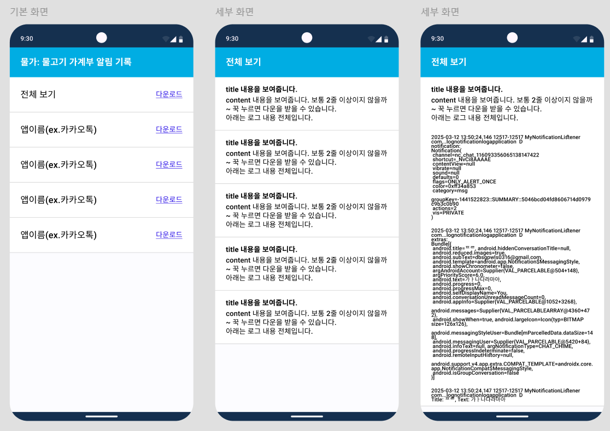

# 3_21 daily study

- 알림 수집 앱 개발 완료

### 물고기 가계부 알림 기록

- 첫 화면 : 알림이 있는 모든 앱 목록
  
  - ⚠️전체 보기 미구현
    
    - 모든 알림이 모여있는 목록
    
    - 아직 필터링이 되지 않아 개인정보 이슈로 필수가 아님
  
  - ⚠️다운로드 미구현
    
    - xml은 밑줄이 안 들어가서 밑줄 넣는데만 30분 걸림...
    
    - 다운로드 글자만 있고 기능 x
    
    - 추후 해당 앱 알림 목록 모두 다운 기능 넣을 예정
    
    - 전체보기와 마찬가지로 아직 필터링이 되지 않아 개인정보 이슈로 필수가 아님

- 두 번째 화면 : 앱 목록을 클릭하면 해당 앱의 알림 목록을 볼 수 있음
  
  - 알림 목록은 알림의 title, content만 제공
  
  - 클릭하면 전체 시스템 메시지 확인 가능
    
    - ⚠️그냥 string 형태로, 보기에 좋지 않아 python의 pprint처럼 json 형태로 보여주게 하려 했으나 아직 미구현. 현재 구현중
  
  - 꾹 눌러서 클립보드로 복사 가능

⚠️추가 이슈

1. 한 알림이 올 때 시스템 메시지는 1개 또는 2개가 온다. 2개가 올 시 하나는 그룹에 관련된 메시지로, 현재 해당 메시지가 그룹 관련 메시지인지, 1개인지 2개인지 구분 불가

2. 1번에서 메시지가 2개 올 때 room db에 앱 이름이 중복 생성되는 이슈
   
   - unique로 해결했으나 group 알림이 같이 오는 2개 세트 알림인 경우 첫 알림(보통 group알림)이 사라짐
   
   - 비동기 이슈로 추정중이며 중요도가 낮아 수정은 안 할 수도 있음

